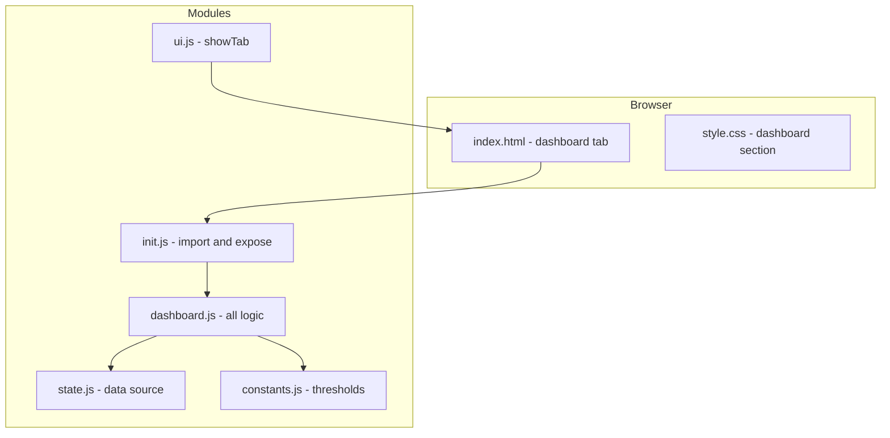
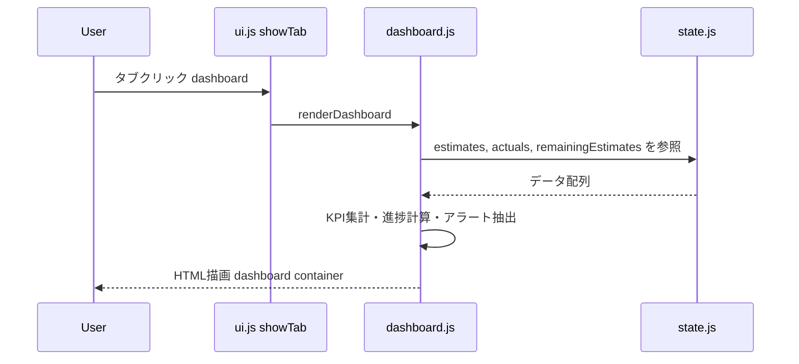
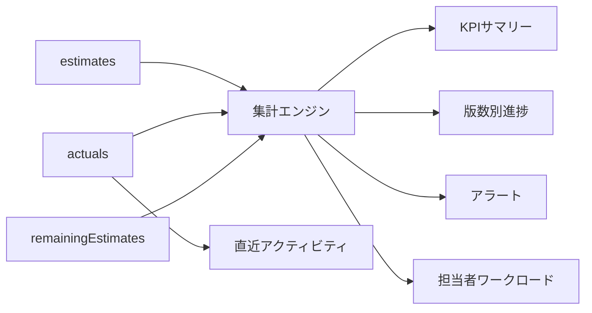

# Design Document — Dashboard

## Overview

**Purpose**: プロジェクトの工数状況を一画面で俯瞰するダッシュボードをユーザーに提供する。見積・実績・進捗の主要KPI、版数別進捗、アラート、担当者ワークロード、直近の活動を集約表示する。

**Users**: プロジェクトマネージャーおよびチームメンバーが日常的な状況確認・意思決定に利用する。

**Impact**: 既存タブ構成に新規タブを追加する。既存モジュール（report.js等）には依存せず、削除・差し替えが容易な独立モジュールとして構成する。

### Goals
- 主要KPIを一目で把握できるサマリービューを提供
- 版数別進捗・アラート・担当者負荷を一画面に集約
- 単一モジュールで自己完結し、着脱・差し替えが容易な設計

### Non-Goals
- 既存レポートタブの置き換え（将来的な差し替えの選択肢として設計するが、現時点では共存）
- Excel出力・印刷機能
- 月次トレンド分析・グラフ描画（Canvas/Chart）
- データの編集・入力機能（参照専用）

## Architecture

### Existing Architecture Analysis

現在のアプリケーションはフレームワークレスSPAで、機能ドメインごとにフラットなESモジュールを配置する構成。タブ切り替えは `data-tab` 属性と `showTab()` 関数で制御し、全状態を `state.js` で一元管理する。

ダッシュボードは以下の制約を遵守する:
- `state.js` と `constants.js` のみに依存（`report.js` 等を import しない）
- `init.js` 経由で `window` に公開
- CSS は `.dashboard-` プレフィックスで名前空間を分離

### Architecture Pattern & Boundary Map



**Architecture Integration**:
- **Selected pattern**: 独立モジュールパターン — 全ロジックを `dashboard.js` 単一ファイルに集約
- **Domain boundary**: ダッシュボードは `state.js` のデータを読み取り専用で参照。他の機能モジュールとの直接依存なし
- **Existing patterns preserved**: `export let` + `setXxx()` による状態参照、`init.js` 経由の `window` 公開、`data-tab` 属性によるタブ管理
- **New components rationale**: `dashboard.js` のみ新規作成。進捗計算ロジックの重複を許容し、着脱容易性を確保
- **Steering compliance**: フラットモジュール構成、ES Modules、localStorage依存の原則を維持

### Technology Stack

| Layer | Choice / Version | Role in Feature | Notes |
|-------|------------------|-----------------|-------|
| Frontend | Vanilla JS (ES2020+) | ダッシュボードUI描画・データ集計 | 新規ライブラリ不要 |
| Data | localStorage (via state.js) | estimates, actuals, remainingEstimates の読み取り | 読み取り専用 |
| Styling | CSS (style.css 追記) | `.dashboard-` プレフィックス付きスタイル | テーマ対応含む |

## System Flows



## Requirements Traceability

| Requirement | Summary | Components | Interfaces | Flows |
|-------------|---------|------------|------------|-------|
| 1.1 | KPIサマリーカード表示 | DashboardRenderer | renderSummaryCards | タブ表示フロー |
| 1.2 | データ更新時の再計算 | DashboardRenderer | renderDashboard | タブ表示フロー |
| 1.3 | 変化方向インジケーター | DashboardState | getPreviousMetrics, saveCurrentMetrics | — |
| 1.4 | データなし案内表示 | DashboardRenderer | renderEmptyState | — |
| 2.1 | 版数別進捗一覧 | ProgressCalculator, DashboardRenderer | calcVersionProgress, renderVersionProgress | — |
| 2.2 | ステータスカラーコード | ProgressCalculator | determineStatus | — |
| 2.3 | 版数クリックでインライン展開 | DashboardRenderer | toggleVersionDetail | — |
| 2.4 | 進捗率昇順ソート | DashboardRenderer | renderVersionProgress | — |
| 3.1 | 見積超過アラート(120%) | AlertAnalyzer | detectAlerts | — |
| 3.2 | 異常値警告(50%) | AlertAnalyzer | detectAlerts | — |
| 3.3 | アラートクリック展開 | DashboardRenderer | toggleAlertDetail | — |
| 3.4 | 「問題なし」表示 | DashboardRenderer | renderAlerts | — |
| 3.5 | 重要度順ソート | AlertAnalyzer | detectAlerts | — |
| 4.1 | 担当者別バー比較 | MemberAnalyzer, DashboardRenderer | calcMemberWorkload, renderMemberWorkload | — |
| 4.2 | キャパシティ超過警告 | MemberAnalyzer | calcMemberWorkload | — |
| 4.3 | 見積精度表示 | MemberAnalyzer | calcMemberWorkload | — |
| 4.4 | 担当者クリック展開 | DashboardRenderer | toggleMemberDetail | — |
| 5.1 | 直近アクティビティ10件 | DashboardRenderer | renderRecentActivity | — |
| 5.2 | アクティビティ詳細項目 | DashboardRenderer | renderRecentActivity | — |
| 5.3 | 入力なし警告 | DashboardRenderer | renderRecentActivity | — |
| 6.1 | タブバー先頭に配置 | TabIntegration | — | — |
| 6.2 | タブ切替時に再描画 | DashboardRenderer | renderDashboard | タブ表示フロー |
| 6.3 | 既存タブに影響なし | TabIntegration | — | — |
| 7.1 | デスクトップグリッド | CSS (.dashboard-grid) | — | — |
| 7.2 | モバイル縦積み | CSS (@media 768px) | — | — |
| 7.3 | テーマ対応 | CSS ([data-design-theme]) | — | — |
| 8.1 | 単一モジュール集約 | dashboard.js | — | — |
| 8.2 | state.jsのみ依存 | dashboard.js | — | — |
| 8.3 | 削除容易性 | TabIntegration, dashboard.js | — | — |
| 8.4 | CSSプレフィックス分離 | CSS (.dashboard-*) | — | — |

## Components and Interfaces

| Component | Domain/Layer | Intent | Req Coverage | Key Dependencies | Contracts |
|-----------|-------------|--------|--------------|-----------------|-----------|
| DashboardModule | JS/Logic | エントリポイント・描画制御 | 1.1-1.4, 6.2 | state.js (P0), constants.js (P1) | State |
| ProgressCalculator | JS/Logic | 版数・タスク別進捗計算 | 2.1-2.4 | state.js (P0), constants.js (P1) | Service |
| AlertAnalyzer | JS/Logic | アラート・異常検知 | 3.1-3.5 | state.js (P0), constants.js (P1) | Service |
| MemberAnalyzer | JS/Logic | 担当者別ワークロード集計 | 4.1-4.4 | state.js (P0) | Service |
| DashboardState | JS/State | 前回値保持・変化方向 | 1.3 | localStorage (P1) | State |
| TabIntegration | HTML/Config | タブ追加・TAB_ORDER更新 | 6.1, 6.3, 8.3 | ui.js (P0) | — |
| DashboardCSS | CSS/Styling | テーマ対応レスポンシブスタイル | 7.1-7.3, 8.4 | style.css (P1) | — |

> 以下、全コンポーネントは `dashboard.js` 単一ファイル内の論理的なグループとして実装する。物理的なファイル分割は行わない。

### JS/Logic Layer

#### DashboardModule

| Field | Detail |
|-------|--------|
| Intent | ダッシュボード全体の描画制御とエントリポイント |
| Requirements | 1.1, 1.2, 1.3, 1.4, 6.2 |

**Responsibilities & Constraints**
- `renderDashboard()` をエントリポイントとし、タブ切替時に呼び出される
- 各セクション（サマリー、進捗、アラート、ワークロード、アクティビティ）を順に描画
- データなし時は空状態メッセージを表示
- `state.js` からのデータ参照は読み取り専用

**Dependencies**
- Inbound: init.js — `window.renderDashboard` として公開 (P0)
- Outbound: state.js — `estimates`, `actuals`, `remainingEstimates` 参照 (P0)
- Outbound: constants.js — `PROGRESS`, `CALCULATIONS` 参照 (P1)

**Contracts**: State [x]

##### State Management

```javascript
/**
 * @typedef {Object} DashboardMetrics
 * @property {number} totalEstimate - 総見積工数
 * @property {number} totalActual - 総実績工数
 * @property {number} variance - 差異（時間）
 * @property {number} variancePercent - 差異（割合）
 * @property {number} progressRate - 全体進捗率
 */

/**
 * @typedef {'up' | 'down' | 'none'} TrendDirection
 */

/**
 * @typedef {Object} DashboardPreviousMetrics
 * @property {number} totalEstimate
 * @property {number} totalActual
 * @property {number} variance
 * @property {number} progressRate
 */
```

- State model: `DashboardPreviousMetrics` を `localStorage` に保存し、次回表示時に変化方向を算出
- Persistence: `localStorage.setItem('manhour_dashboardPrevMetrics', JSON.stringify(metrics))`
- Concurrency: 単一タブ動作のため排他制御不要

**Implementation Notes**
- `#dashboard` コンテナ内に `innerHTML` で描画。XSSリスクはユーザー入力データの sanitize で対応
- タブ切替時に `renderDashboard()` を毎回呼び出し、キャッシュは持たない（データ鮮度優先）

---

#### ProgressCalculator

| Field | Detail |
|-------|--------|
| Intent | 版数・タスク単位の進捗率・ステータスを計算 |
| Requirements | 2.1, 2.2, 2.3, 2.4 |

**Responsibilities & Constraints**
- `report.js` の `calculateProgress` / `calculateVersionProgress` と同等のロジックを独自実装
- `constants.js` の `PROGRESS.WARNING_THRESHOLD (1.2)` を閾値として使用
- 版数の一覧は `estimates` 配列から動的に抽出

**Contracts**: Service [x]

##### Service Interface

```javascript
/**
 * @typedef {Object} VersionProgressResult
 * @property {string} version
 * @property {number} estimatedHours
 * @property {number} actualHours
 * @property {number} remainingHours
 * @property {number} eac
 * @property {number} progressRate
 * @property {string} status - 'completed' | 'ontrack' | 'warning' | 'exceeded' | 'unknown'
 * @property {string} statusLabel
 * @property {string} statusColor
 * @property {number} totalTasks
 * @property {number} completedTasks
 */

/**
 * @typedef {Object} TaskProgressResult
 * @property {string} task
 * @property {string} process
 * @property {number} estimatedHours
 * @property {number} actualHours
 * @property {number} remainingHours
 * @property {number} eac
 * @property {number} progressRate
 * @property {string} status
 * @property {string} statusLabel
 * @property {string} statusColor
 */

/**
 * 全版数の進捗を計算し、進捗率の昇順でソートして返す
 * @returns {VersionProgressResult[]}
 */
function calcAllVersionProgress() {}

/**
 * 指定版数内のタスク別進捗を返す
 * @param {string} version
 * @returns {TaskProgressResult[]}
 */
function calcTaskProgressForVersion(version) {}
```

- Preconditions: `estimates` 配列が読み込み済み
- Postconditions: 進捗率は 0〜100+（超過時は100超）、ステータスは5値のいずれか
- Invariants: EAC = actualHours + remainingHours

---

#### AlertAnalyzer

| Field | Detail |
|-------|--------|
| Intent | 見積超過・異常値タスクの検出とソート |
| Requirements | 3.1, 3.2, 3.3, 3.4, 3.5 |

**Responsibilities & Constraints**
- 超過タスク: 実績 ÷ 見積 ≥ 1.2（120%超過）
- 異常値タスク: |実績 − 見積| ÷ 見積 ≥ 0.5（50%乖離）
- 超過率の降順でソート

**Contracts**: Service [x]

##### Service Interface

```javascript
/**
 * @typedef {'overrun' | 'anomaly'} AlertType
 */

/**
 * @typedef {Object} AlertItem
 * @property {AlertType} type
 * @property {string} version
 * @property {string} task
 * @property {number} estimatedHours
 * @property {number} actualHours
 * @property {number} overrunPercent - 超過率(%)
 */

/**
 * アラート対象タスクを検出し、超過率の降順でソートして返す
 * @returns {AlertItem[]}
 */
function detectAlerts() {}
```

- Preconditions: `estimates`, `actuals` が読み込み済み
- Postconditions: 空配列の場合はアラートなし（正常状態）

---

#### MemberAnalyzer

| Field | Detail |
|-------|--------|
| Intent | 担当者別のワークロード・見積精度を集計 |
| Requirements | 4.1, 4.2, 4.3, 4.4 |

**Responsibilities & Constraints**
- 担当者一覧は `estimates` + `actuals` から動的に抽出
- キャパシティ基準: `CALCULATIONS.HOURS_PER_MAN_MONTH` (160h) ※ `CALCULATIONS.DAYS_PER_MONTH (20) × CALCULATIONS.HOURS_PER_DAY (8)`
- 見積精度: (実績 ÷ 見積) × 100

**Contracts**: Service [x]

##### Service Interface

```javascript
/**
 * @typedef {Object} MemberWorkload
 * @property {string} member
 * @property {number} estimatedHours
 * @property {number} actualHours
 * @property {number} accuracyPercent - 見積精度(%)
 * @property {boolean} isOverCapacity - キャパシティ超過フラグ
 * @property {MemberTaskDetail[]} tasks - 展開用の詳細
 */

/**
 * @typedef {Object} MemberTaskDetail
 * @property {string} version
 * @property {string} task
 * @property {number} hours
 * @property {string} date
 */

/**
 * 全担当者のワークロードを集計して返す
 * @returns {MemberWorkload[]}
 */
function calcMemberWorkload() {}
```

- Preconditions: `estimates`, `actuals` が読み込み済み
- Postconditions: `accuracyPercent` は見積が0の場合は `null`

---

### HTML/Config Layer

#### TabIntegration

| Field | Detail |
|-------|--------|
| Intent | 既存タブシステムへのダッシュボード統合 |
| Requirements | 6.1, 6.3, 8.3 |

**Implementation Notes**
- `index.html`: タブボタンを既存ボタン群の先頭に追加（`data-tab="dashboard"`）
- `index.html`: `<div id="dashboard" class="tab-content">` をタブコンテンツ領域に追加
- `js/ui.js`: `TAB_ORDER` 配列の先頭に `'dashboard'` を挿入
- `js/init.js`: `import * as Dashboard from './dashboard.js'` を追加し、`window.renderDashboard` 等を公開
- `index.html:28`: 初期タブ検証リストに `'dashboard'` を追加
- **削除手順**: 上記5箇所の追加分を除去するだけで完全に撤去可能

---

### CSS/Styling Layer

#### DashboardCSS

| Field | Detail |
|-------|--------|
| Intent | ダッシュボード固有のスタイル定義（テーマ・レスポンシブ対応） |
| Requirements | 7.1, 7.2, 7.3, 8.4 |

**Implementation Notes**
- `style.css` 末尾に `/* ===== Dashboard ===== */` セクションとして追記
- 全クラスに `.dashboard-` プレフィックスを付与
- 主要クラス: `.dashboard-grid`, `.dashboard-card`, `.dashboard-section`, `.dashboard-progress-bar`, `.dashboard-alert-item`, `.dashboard-member-bar`
- `.dashboard-grid`: デスクトップ `grid-template-columns: repeat(auto-fit, minmax(200px, 1fr))`、モバイル `1fr`
- テーマ対応: `[data-design-theme="obsidian"] .dashboard-card` 等のオーバーライドを各テーマ分定義
- 削除時: `/* ===== Dashboard ===== */` から末尾までを削除

## Data Models

### Domain Model

ダッシュボードは新規のデータモデルを持たない。既存の `estimates`、`actuals`、`remainingEstimates` 配列を読み取り専用で参照する。

唯一の永続データは前回表示時のメトリクス（変化方向インジケーター用）:

```javascript
/**
 * localStorage key: 'manhour_dashboardPrevMetrics'
 * @type {DashboardPreviousMetrics | null}
 */
```

### Logical Data Model

**集計パイプライン**:

1. `estimates[]` → 版数ごとにグループ化 → 版数別見積合計
2. `actuals[]` → 版数ごとにグループ化 → 版数別実績合計
3. `remainingEstimates[]` → 版数×タスクで結合 → EAC算出
4. 上記を統合 → KPIサマリー、版数別進捗、アラート、担当者ワークロード

**データフロー図**:



## Error Handling

### Error Strategy
ダッシュボードは参照専用のため、エラーは主にデータ不在とレンダリング失敗に限定される。

### Error Categories and Responses
- **データ不在** (1.4, 3.4, 5.3): 空状態メッセージを表示し、正常に動作を継続
- **レンダリングエラー**: try-catch で包み、コンソールにログ出力。ユーザーにはフォールバックメッセージを表示
- **localStorage アクセスエラー**: 前回メトリクスの読み書き失敗時はインジケーターを非表示にし、描画は継続

## Testing Strategy

### 手動テスト項目
- **KPIサマリー**: 見積・実績データの追加・削除後にダッシュボードタブで値が正しく更新されることを確認
- **版数別進捗**: 複数版数のデータでプログレスバーのステータスカラーとソート順を確認
- **アラート**: 120%超過・50%乖離のテストデータでアラートが正しく表示されることを確認
- **担当者ワークロード**: 複数担当者のデータでバー表示と超過警告を確認
- **レスポンシブ**: 768px前後でレイアウトの切り替えを確認
- **テーマ**: 全5テーマ（default, obsidian, paper, mosaic, graphite）でスタイル崩れがないことを確認
- **着脱**: dashboard.js 削除 + HTML/CSS/init.js の修正で他機能に影響がないことを確認
- **空状態**: データなしでダッシュボードが正常に「データなし」を表示することを確認
