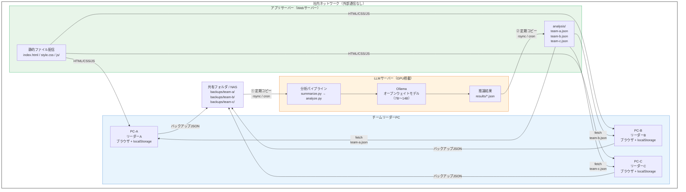
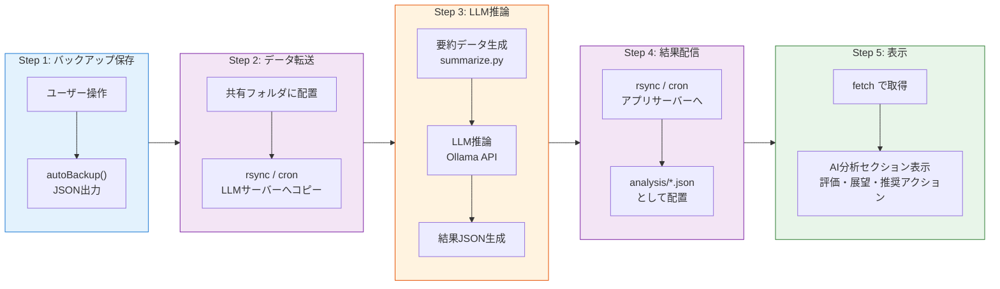
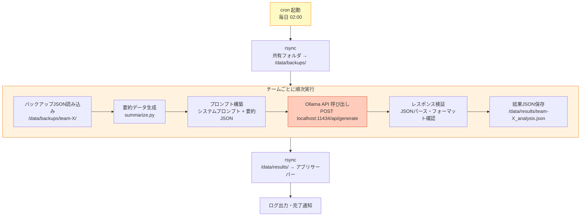
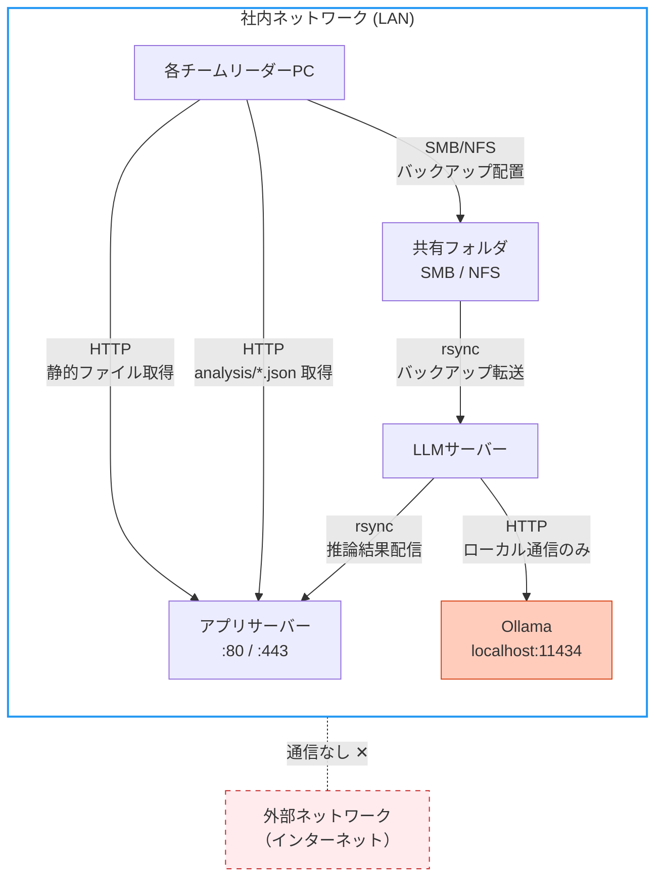
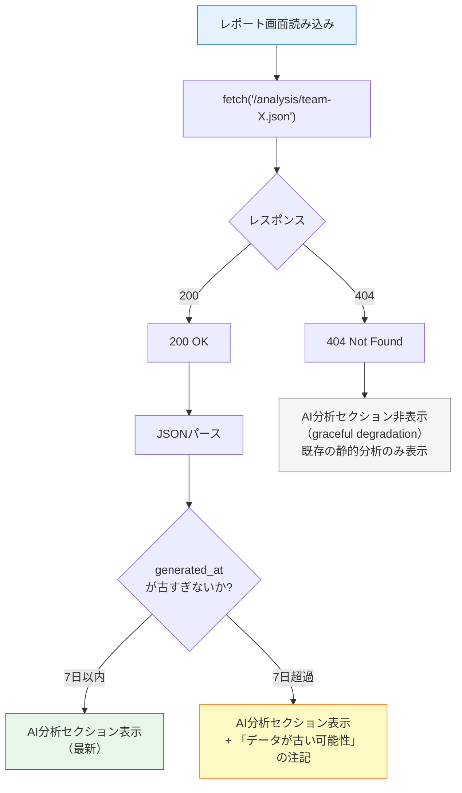

# ローカルLLM分析機能 - 実装構成図（Mermaid）

> **ステータス**: 構想段階（2026-02-24時点）
> **関連ドキュメント**: [構想メモ](./LLM_ANALYSIS_CONCEPT.md) / [テキスト版構成図](./LLM_ANALYSIS_ARCHITECTURE.md)

---

## 1. サーバー構成 全体図

---

## 2. データフロー

---

## 3. LLMサーバー内部 パイプライン

---

## 4. データ変換フロー

```mermaid
flowchart LR
    subgraph RAW["バックアップJSON（生データ）"]
        EST["estimates<br/>見積レコード"]
        ACT["actuals<br/>実績レコード"]
        REM["remainingEstimates<br/>残見積"]
        SCH["schedules<br/>スケジュール"]
    end

    subgraph SUMMARY["要約JSON（中間データ）"]
        OVR["overall<br/>全体の精度・タスク数"]
        VER["by_version<br/>バージョン別進捗"]
        PRC["by_process<br/>工程別精度"]
        MEM["by_member<br/>メンバー別パフォーマンス"]
        TRD["monthly_trend<br/>月次トレンド"]
        CAP["capacity<br/>キャパシティ情報"]
        ANO["anomalies<br/>異常値タスク"]
    end

    subgraph RESULT["推論結果JSON（最終出力）"]
        EVAL["team_evaluation<br/>総合評価・スコア・強み・課題"]
        OUTLOOK["outlook<br/>完了予測・精度予測・リスク"]
        ACTIONS["recommended_actions<br/>優先度付きプロセス改善提案"]
        NEXT["next_review_focus<br/>次回注視ポイント"]
    end

    RAW -- "summarize.py<br/>集計・計算" --> SUMMARY
    SUMMARY -- "LLM推論<br/>analyze.py" --> RESULT

    style RAW fill:#e3f2fd,stroke:#1565c0
    style SUMMARY fill:#fff3e0,stroke:#e65100
    style RESULT fill:#e8f5e9,stroke:#2e7d32
```

---

## 5. ネットワーク構成

---

## 6. 定期実行タイムライン

```mermaid
gantt
    title 夜間バッチ処理スケジュール
    dateFormat HH:mm
    axisFormat %H:%M

    section データ転送
    共有フォルダ → LLMサーバー (rsync)   :a1, 02:00, 5m

    section LLM推論
    チームA 要約生成 + 推論              :a2, after a1, 10m
    チームB 要約生成 + 推論              :a3, after a2, 10m
    チームC 要約生成 + 推論              :a4, after a3, 10m

    section 結果配信
    LLMサーバー → アプリサーバー (rsync)  :a5, after a4, 5m

    section ユーザー利用
    出社・レポート確認                    :milestone, 09:00, 0m
```

---

## 7. フロントエンド表示フロー

